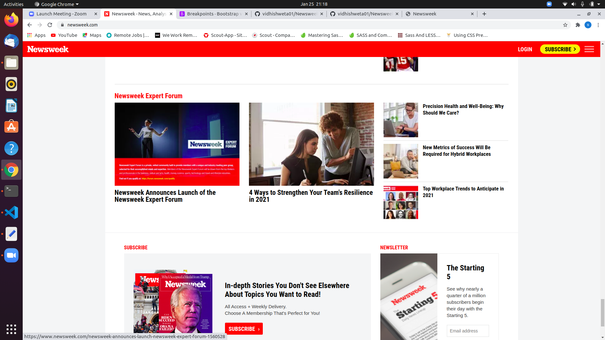

# Newsweek-clone

A TheNewsweek clone, used for training purposes

This is a project for the Microverse training program, Week 3, and it aims to simulate the HTML,CSS and Bootstrap parts of the [Newsweek](https://newsweek.com/).

## Built With

HTML
CSS
Bootstrap

## Live Demo

[Try a lıve demo](https://vidhishweta01.github.io/Newsweek-clone/)

## Authors 👤

### Shweta Srivastava

_[Github](https://github.com/vidhishweta01)

_[LinkedIn](http://linkedin.com/in/shweta-s-15a57070)

### Fares Ashraf

_[Github]( https://github.com/ashraffares/http-ashraffares.github.io-)

_[LinkedIn](https://www.linkedin.com/in/fares-ashraf-382a35176/)

## Show your support ⭐️⭐️

Give a star if you like this project!

## License 📝
This project is [MIT](https://www.mit.edu/~amini/LICENSE.md) licensed.
